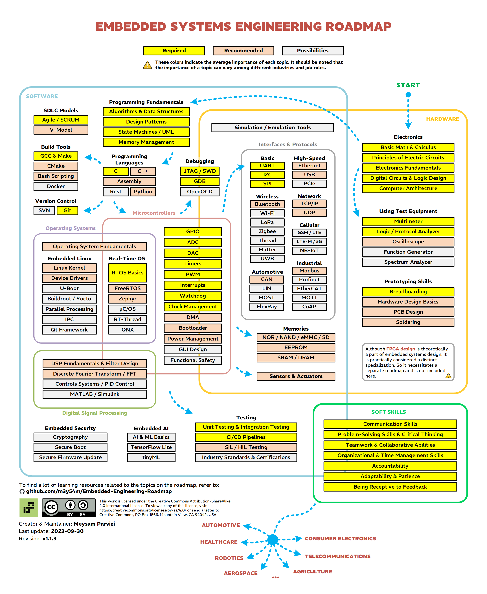

# 嵌入式开发学习路线
[返回主页](../research-study/readme.md)
[返回嵌入式学习主页](Readme.md)
> [参考：嵌入式工程师学习路线-github-m3y54m](https://www.github.com/m3y54m/Embedded-Engineering-Roadmap)  

[toc]

## 引言
1) 成为嵌入式工程师需要具备：
* 深入学习的高度积极性和热情
* 对硬件功能的深刻理解
* 克服挑战的耐心和热情
2) 什么是嵌入式系统
* ISO/IEC/IEEE 24765 标准：**计算机系统**是大系统的一部分，完成系统的一些需求，比如飞行器的计算机系统；**嵌入式系统**更是为某种功能做了最优化和微型化的
  * 嵌入式系统构成：微控制器、微处理器或数字信号处理器
  * 嵌入式系统设计目标：优化可靠性、成本、大小、节能
* 《构建嵌入式系统》：嵌入式系统是**专为某应用构建**的计算机系统
* 《计算机组织和嵌入式系统》：为**专用目的**应用计算机控制的物理系统，而不是为通用目的运算
* *Analog Devices* 的词汇表：嵌入式系统是计算机作为该系统的整体组成部分的系统；通常计算机是不可见的（无应用、文件、操作系统），比如微波炉控制、自动驾驶汽车引擎控制
* *Barr Group* 的嵌入式设备词汇表：为特定功能设计的计算机软硬件的组合，可能还会有机械部分或其他部分；有些情况是更大系统或产品的一部分（汽车的防抱死系统）
## 技术路线
技术路线分成三部分：**软件**、**硬件**、和**软技能**；嵌入式工作的软硬件会有重叠，也会有侧重，理解每个公司的特殊需求是关键，不要忽略标题：
| 工作标题 | 关注点 |
|---|---|
| 嵌入式软件工程师/框架工程师/嵌入式Linux软件工程师 | 软件 |
|嵌入式硬件工程师/硬件设计工程师|硬件|
|嵌入式系统工程师|软件和硬件|

软技能不仅仅靠阅读和看视频，更靠的是跟其他人**交流**和面对作业**挑战**，提高软技能没有一招致胜的方法，它依靠我们的**个人特质**（比如优缺点），下文专注于软件部分的技术路线：

### 硬件学习
1) 电子相关 
* 基础数学和运算√ 
* 电路原理√
* 电子学基础√
* 数字电路和逻辑设计
* 计算机架构

2) 使用仪器
* 万用表
* 示波器
* 函数发生器
* 网络分析仪
* 逻辑分析仪

3) 原型机开发技术
* 面包板
* 硬件设计基础
* PCB设计
* 焊接

4) 接口和协议
* 基础：UART，I2C，SPI |
* 高速：| Ethernet，USB | PCIe
* 无线：| 蓝牙 | WI-FI，LoRa，Zigbee，Thread，Matter，UWB
* 网络：| TCP/IP UDP |
* 自动驾驶：|CAN|LIN，MOST，FlexRay
* 工业：|Modbus|MQTT...

5) 存储器
* NOR/NAND/eMMC/SD
* EEPROM
* SRAM/DRAM

6) 求职要求
* ARM架构
* Linux驱动开发

### 软件学习
1) 编程基础
* 算法和数据结构
* 设计模式
  > 可以用**不透明指针**的设计模式达到**对象**的效果
* 状态机/UML
* 内存管理

2) 编程语言
* C语言|C++，汇编，Python|Rust

3) 版本控制
* Git | | SVN

4) 编译器
* GCC & Make| CMake，Bash Scripting | Docker

5) 操作系统
* 操作系统基础
* 嵌入式Linux
  Linux 内核，设备驱动 | U-Boot ...
* 实时操作系统
  RTOS 基础 | FreeRTOS, Zephyr | uC/OS, RT-Thread, QNX

6) 数字信号处理

7) 嵌入式安全性

8) 嵌入式AI
* AI & ML 基础，TensorFlow Lite，tinyML

9) 软件开发生命循环模式

### 软硬件
1) 调试
* JTAG/SWD，GDB | OpenOCD

2) 微控制器
* GPIO/ADC/DAC/Timers/PWM/中断/看门狗/时钟管理 | DMA/Bootloader/功耗管理 | GUI设计，功能安全

3) 实时操作系统

4) 数字信号处理

### 软技能
1) 沟通技能

2) 解决问题技能和批判性思维

3) 团队合作能力

4) 组织和时间管理能力

5) 责任心

6) 适应性和耐心

7) 接受反馈
