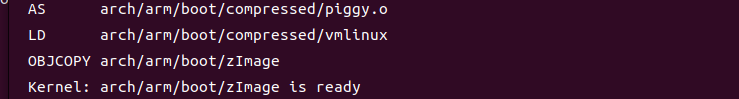
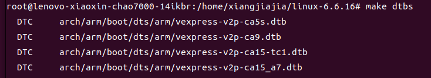
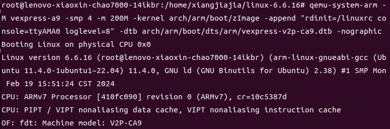
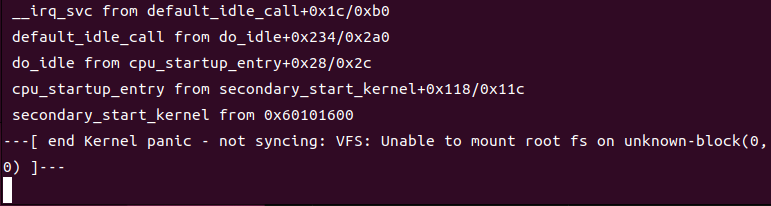
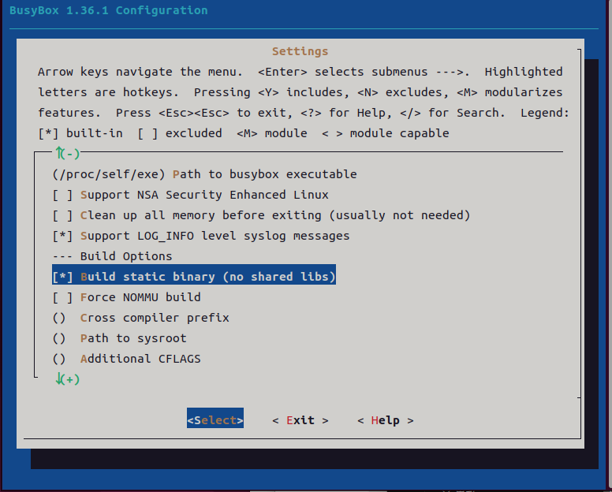
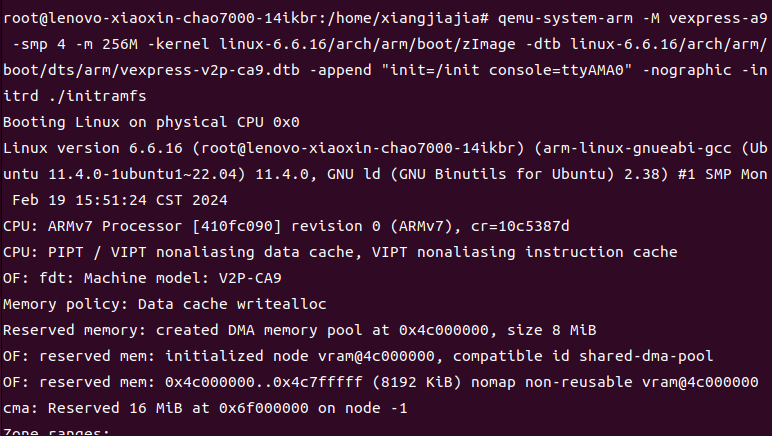
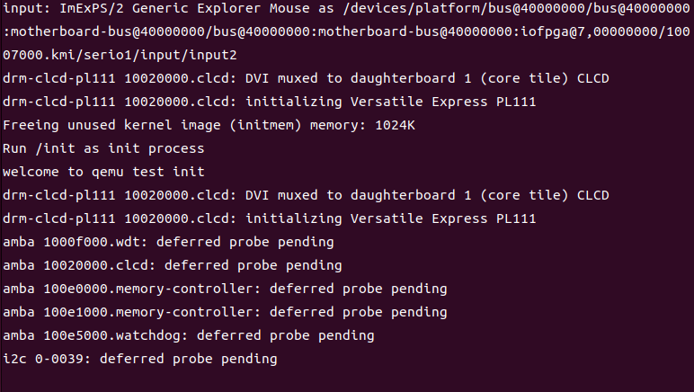
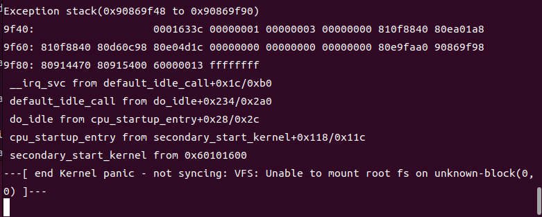

# 驱动开发教程
[toc]
一次构建内核真的困难重重，经过...，终于成功了，将步骤公开，小伙伴们少走弯路,Uboot和Linux内核移植的重点就在于，根据你的板卡，选择相应的默认配置信息/boot/configs,会写shell脚本
## 环境配置
工欲善其事必先利其器
### Ubuntu虚拟机
* 我们需要准备一个Linux系统的环境，可以用虚拟机搭建
* 正点原子提供了开源的虚拟机和系统镜像的资料和搭建教程,请自取：[]
* 博主在实践过程中发现用虚拟机存在挺多问题，比如虚拟机网络问题导致不能安装一些库、导致电脑蓝屏、卡慢等等，于是用的自己笔记本装的双系统，读者如果要安装双系统，可以查自己电脑型号对应的双系统安装教程，也比较繁杂，但是之后就是在真正的Linux里搞开发，不存在虚拟机里莫名其妙的问题。
* 博主的平台信息是：
    Ubuntu：Ubuntu 22.04
    gcc交叉编译器：x86_64-linux-gnu-gcc-12 12.3.0
    arm-linux : 4:11.2.0-1ubuntu1
    gcc：gcc version 11.4.0
    linux内核：Linux version 6.5.0-15-generic
### Qemu
* 系统搭建好了之后安装qemu：
```
sudo apt-get install qemu
sudo apt-get install qemu-system
```

### 编译内核
* 内核下载地址(https://cdn.kernel.org/pub/linux/kernel/v4.x/)
* 解压，进入文件夹
* 编译内核
```
export ARCH=arm
export CROSS_COMPILE=arm-linux-gnueabi-
make vexpress_defconfig
%make menuconfig
```
然后按两次esc退出,开始编译内核，时间有一点久

make all
或者
make bzImage

make dtbs


我们需要两个文件：
Linux内核镜像文件：zImage
versatile Express平台的设备树文件：vexpress-v2p-ca9.dtb(在arch/arm/boot/dts/文件夹下)
等待的时间讲一下基础知识

```
关于vexpress_defconfig
arch/arm/configs

关于 make all
```
```
qemu-system-arm -M vexpress-a9 -smp 4 -m 200M -kernel arch/arm/boot/zImage -append "rdinit=/linuxrc console=ttyAMA0 loglevel=8" -dtb arch/arm/boot/dts/arm/vexpress-v2p-ca9.dtb -nographic
```
编译好了之后在qemu运行,提示信息开头，说明成功进入内核

因为我们还没编译根文件系统（用busybox制作），所以进入内核之后，尾行提示内核崩溃

退出qemu：在另一个终端输入killall qemu-system-arm或者在qemu中输入ctrl+a再输入x
### busybox
* 下载网站(https://busybox.net/)
* 博主下载的版本是1.36.1
* 解压进入busybox，对busybox进行配置，使用默认配置
```
make defconfig
make menuconfig
```
配置静态编译：Setting->Build static binary，点空格把它选上

然后退出 make
make install CONFIG_PREFIX=/home/xiangjiajia/rootfs 将编译结果指定存放在根文件系统目录下
* 创建etc,dev,mnt,sys,tmp,proc,root等目录
* 创建如下设备节点
```
cd dev/
sudo mknod console c 5 1
sudo mknod null c 1 3

```
然后把这个根文件系统打包成镜像(https://blog.csdn.net/amateurSU/article/details/134031150)
qemu-img create -f raw disk.img 200M

出现问题：https://blog.csdn.net/u013968786/article/details/51115594?

写一个/etc/init.d/rcS文件,注意给权限
```
#！/bin/sh
mount -a
mkdir /dev/pts
mount -t devpts devpts /dev/pts
echo /sbin/mdev > /proc/sys/kernel/hotplug
mdev -s

```
还要创建一个/etc/fstab文件，这个文件在开机之后设置自动挂载哪些分区
```
proc            /proc           proc      defaults       0       0
tmpfs           /tmp            tmpfs     defaults       0       0
sysfs           /sys            sysfs     defaults       0       0

```
还要创建一个/etc/inittab文件
（这三个文件的解释见原子文档的p1028页）
```
::sysinit:/etc/init.d/rcS
::respawn:-/bin/sh
console::askfirst:-/bin/sh
::restart:/sbin/init 
::ctrlaltdel:/sbin/reboot
::shutdown:/bin/umount -a -r


```
制作镜像
```
qemu-img create -f raw linux.img 256M
mkfs -t ext4 ./linux.img

mkdir tmpfs
sudo mount -o loop ./linux.img tmpfs/
sudo cp -r rootfs/* tmpfs/
sudo umount tmpfs 
rm -r tmpfs
file linux.img
```
---[ end Kernel panic - not syncing: VFS: Unable to mount root fs on unknown-block(0,0) ]---
根文件系统构建有问题
参考（https://blog.csdn.net/weixin_38227420/article/details/88402738）
重新构建文件系统，先来个简单的
```
vim init.c

arm-linux-gnueabi-gcc -static -o init init.c
echo init|cpio -o --format=newc > initramfs

qemu-system-arm -M vexpress-a9 -smp 4 -m 256M -kernel linux-6.6.16/arch/arm/boot/zImage -dtb linux-6.6.16/arch/arm/boot/dts/arm/vexpress-v2p-ca9.dtb -append "init=/init console=ttyAMA0" -nographic -initrd ./initramfs

```



对比下来rcS和fstab写得不一样
写一个/etc/init.d/rcS文件,注意给权限
```
#！/bin/sh
mount -t proc none /proc
mount -t sysfs none /sys
sbin/mdev -s

```
不要/etc/fstab文件，手动挂载了
```
```
制作镜像
find ./rootfs/ | cpio -o --format=newc > ./rootfs.img
跟镜像没关系，一样的错
qemu-system-arm -M vexpress-a9 -smp 4 -m 256M -kernel linux-6.6.16/arch/arm/boot/zImage -dtb linux-6.6.16/arch/arm/boot/dts/arm/vexpress-v2p-ca9.dtb -append "root=/dev/ram rdinit=sbin/init console=ttyAMA0" -nographic -initrd ./rootfs.img


出现一样的问题，不能挂载根文件系统在未知的块
参考（https://blog.csdn.net/qq153471503/article/details/126976481）

看原子哥的资料，可能是因为root = /dev/mmcblk
挂载root的原因，之后试一下


可能是根文件系统没构建好
之后参考这篇文章再重新弄吧（https://blog.csdn.net/cotex_A9/article/details/132354963）

cd busybox-1.36.1
vi automake_arm32.sh
 
# 在automake_arm32.sh中添加下列代码
make ARCH=arm CROSS_COMPILE=arm-linux-gnueabi- clean
make ARCH=arm CROSS_COMPILE=arm-linux-gnueabi- menuconfig
make ARCH=arm CROSS_COMPILE=arm-linux-gnueabi- -j12
make ARCH=arm CROSS_COMPILE=arm-linux-gnueabi- CONFIG_PREFIX=../objects/rootfs-arm32 install

chmod +x automake_arm32.sh
./automake_arm32.sh

将“Settings->Build Options->Build static binary”选上

cd ../objects/rootfs-arm32

mkdir dev
sudo mknod -m 666 dev/tty1 c 4 1
sudo mknod -m 666 dev/tty2 c 4 2
sudo mknod -m 666 dev/tty3 c 4 3
sudo mknod -m 666 dev/tty4 c 4 4
sudo mknod -m 666 dev/console c 5 1
sudo mknod -m 666 dev/null c 1 3

mkdir lib
sudo cp -d /usr/arm-linux-gnueabi/lib/*.so* ./lib


mkdir -p etc/init.d
touch etc/init.d/rcS
chmod 777 etc/init.d/rcS
vim etc/init.d/rcS

标注这几个文件的出处

touch etc/fstab
vim etc/fstab
 
# 在fstab中填入以下内容
proc    /proc           proc    defaults        0       0
none    /dev/pts        devpts  mode=0622       0       0
mdev    /dev            ramfs   defaults        0       0
sysfs   /sys            sysfs   defaults        0       0
tmpfs   /dev/shm        tmpfs   defaults        0       0
tmpfs   /dev            tmpfs   defaults        0       0
tmpfs   /mnt            tmpfs   defaults        0       0
var     /dev            tmpfs   defaults        0       0
ramfs   /dev            ramfs   defaults        0       0

touch etc/profile
vim etc/profile
 

#!/bin/sh 
USER="root"
LOGNAME=$USER
# export HOSTNAME=vexpress-a9
export HOSTNAME=`cat /etc/sysconfig/HOSTNAME`
export USER=root
export HOME=root
export PS1="[$USER@$HOSTNAME:\w]\#"
PATH=/bin:/sbin:/usr/bin:/usr/sbin 
LD_LIBRARY_PATH=/lib:/usr/lib:$LD_LIBRARY_PATH
export PATH LD_LIBRARY_PATH


mkdir etc/sysconfig
vi etc/sysconfig/HOSTNAME
 
# 在HOSTNAME中添加以下内容
vexpress-a9

mkdir mnt proc root sys tmp var


cd ..
sudo mkdir /mnt/rootfs
sudo chmod 777 /mnt/rootfs
vi makefs-arm32.sh

chmod +x makefs-arm32.sh
./makefs-arm32.sh


vi qemu-start-vexpress-a9.sh

chmod +x qemu-start-vexpress-a9.sh
./qemu-start-vexpress-a9.sh
路径要改一下，完美运行了！！！

qemu自带bootloader

这个博主写批处理文件来完成构建感觉很专业，反复操作更有效率

我来二创，我的写法是让小白能一行一行看懂，不必写批处理

### Uboot以及Linux内核编译
### 尝试安装第一个虚拟设备驱动

### 给热爱学习的小伙伴开的书单
* 深度探索Linux操作系统：系统构建和原理解析
    可以看出作者十分热爱技术，文字里充满激情，本文章借鉴了本书1——4章的内容。
* 奔跑吧Linux内核：入门篇
    这本书对初学者不太友好，我认为对于细节的处理是一本教材的灵魂，这本书恰恰在细节处的处理很潦草，有一些地方没展开讲，但本书以实验促进学习，使用qemu平台的思想很好，本系列也算是借鉴这本书的讲解思想。
* 正点原子的I.MX6U嵌入式Linux驱动开发指南V1.81（原子哥网站开源获取）
    原子哥的教程非常全，从Linux系统使用开始讲的，而且有配套实践视频，缺点就是太多了太全了，我认为初学者学习还是先有主线，先学重点，然后逐渐衍生学习才好
* qemu的help手册 boot特殊命令

### 欢迎评论
* 博主也是嵌入式初学，水平有限，文章难免有错误和不准确的地方，恳请广大读者提出宝贵意见！！！十分愿意与大家交流！！！


